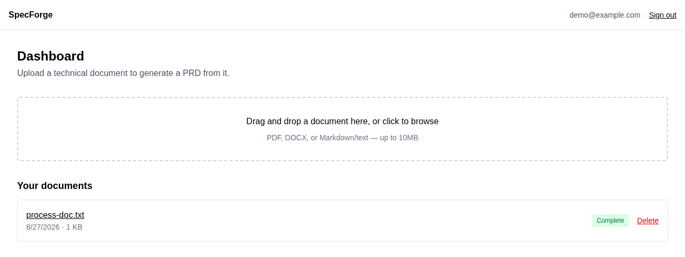
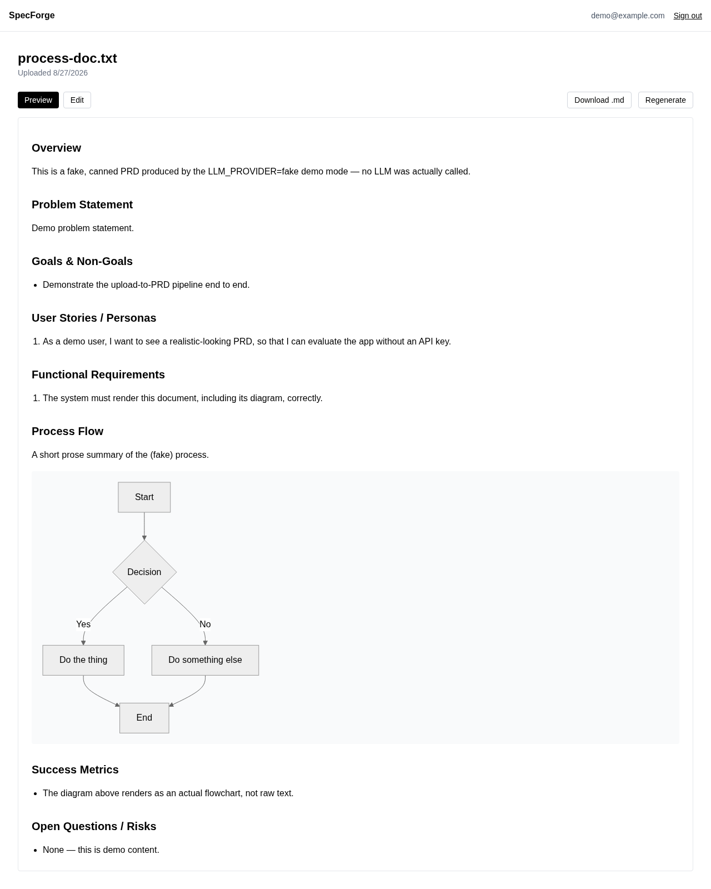

# SpecForge

Upload a technical document describing a process flow. SpecForge parses it, generates a structured PRD with an LLM — including a rendered process-flow diagram — and lets you view, edit, and export it.





## Quick start

```sh
docker compose up
```

Open http://localhost:3000. Everything — the app, the background worker, Postgres, Redis, and MinIO — starts together, and the database is set up automatically.

By default it uses a **fake LLM provider** (no API key needed), so you can try the whole upload → PRD flow immediately. To use a real model, set `LLM_PROVIDER=anthropic` and `ANTHROPIC_API_KEY=<your key>`, or `LLM_PROVIDER=openai` and `OPENAI_API_KEY=<your key>`, before running the command above.

## Local development

```sh
docker compose up -d postgres redis minio   # backing services only
cp .env.example .env                        # then set AUTH_SECRET (openssl rand -base64 32)
npm install
npm run prisma:migrate
npm run dev          # terminal 1 — the app
npm run worker:dev   # terminal 2 — parses documents and calls the LLM
```

`npm test` runs the test suite (needs `docker compose up -d postgres`).
